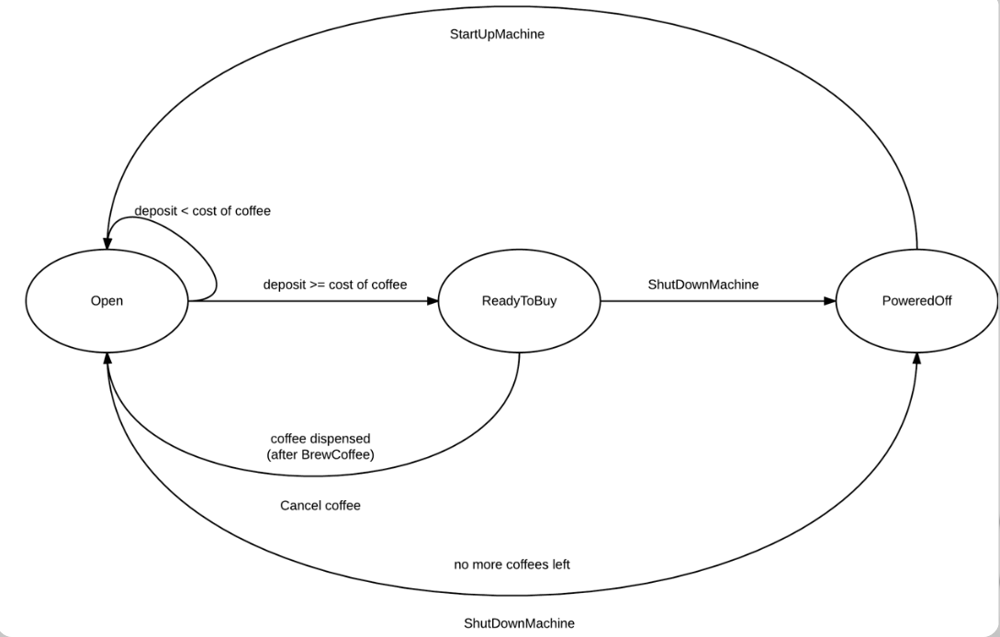
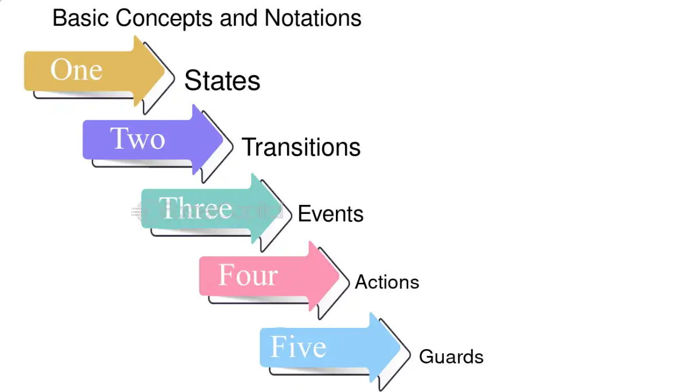
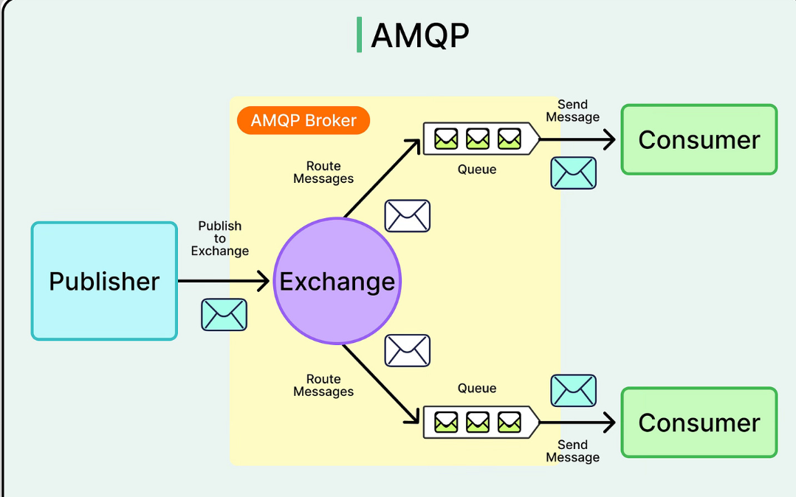
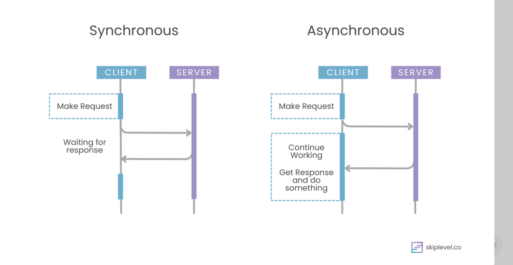
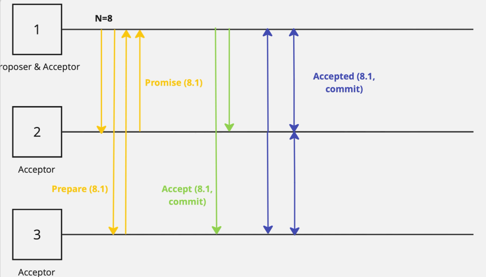
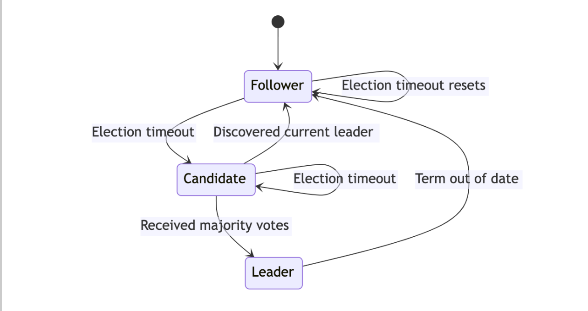
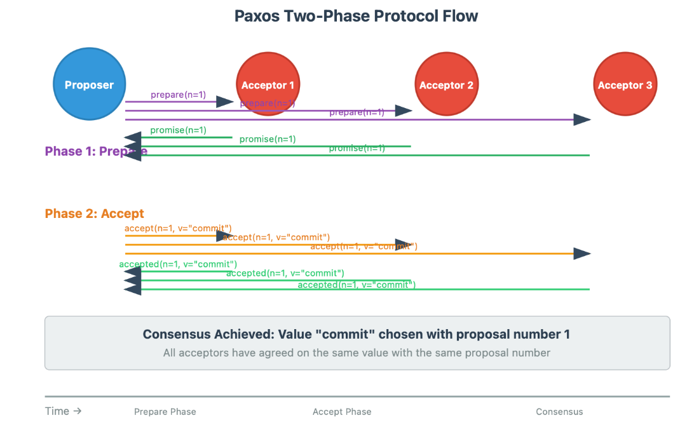
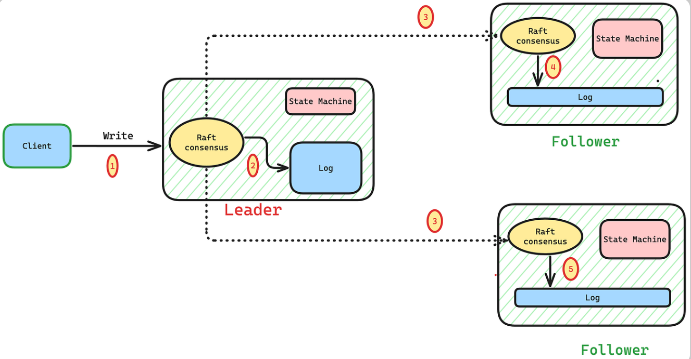
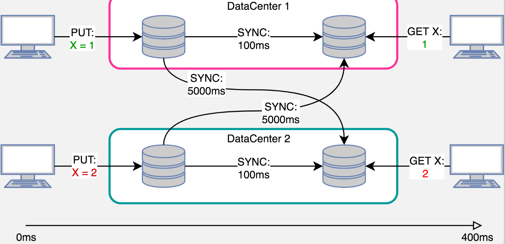
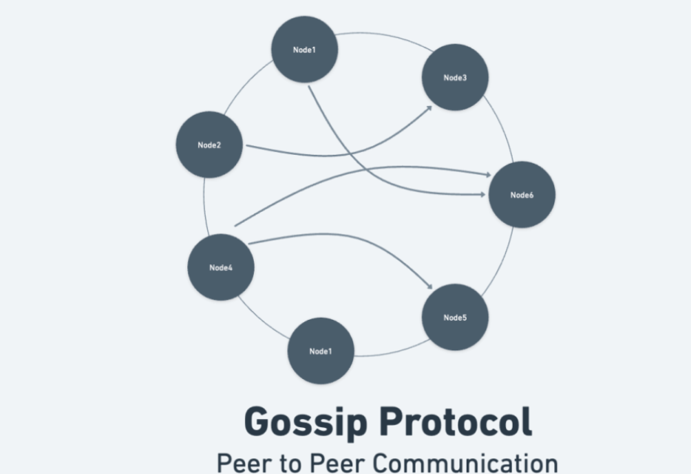

## Overview

Modern large-scale distributed systems underpin critical infrastructure in cloud computing, financial services, social platforms, and emerging decentralized applications. These systems exhibit immense complexity arising from concurrency, asynchrony, network partitions, node failures, message reordering or loss, and dynamic scaling across thousands or millions of nodes. Guaranteeing correctness properties—such as safety in consensus protocols (e.g., agreement and validity in Raft or Paxos variants), eventual consistency in replicated data stores (e.g., strong eventual consistency via CRDTs), and fault tolerance in microservices architectures—remains extraordinarily challenging in production environments.

Traditional software engineering practices, particularly testing and simulation, fall short in providing sufficient assurance. Unit and integration tests often explore only a narrow subset of possible executions, while even extensive chaos engineering or fuzzing cannot exhaustively cover the vast state space induced by non-deterministic interleavings, timing variations, and rare failure combinations. Bugs in distributed systems frequently manifest only under specific adversarial conditions, leading to data loss, service outages, or consistency violations that evade detection until they impact users at scale.

Formal verification techniques offer a rigorous alternative by mathematically proving that systems satisfy specified properties under all possible behaviors within defined models. Tools such as TLA+ enable high-level specification and model checking of temporal properties for protocols like consensus algorithms, uncovering subtle bugs through exhaustive exploration of finite-state abstractions. Alloy supports relational modeling and bounded checking, proving useful for analyzing consistency models and microservice interactions via counterexample generation. Isabelle/HOL, an interactive theorem prover, facilitates mechanized proofs of complex invariants, as demonstrated in verifications of strong eventual consistency for CRDTs and Byzantine fault-tolerant consensus algorithms under realistic fault models.

Despite these strengths, purely offline formal verification—conducted on abstract models or high-level designs—cannot fully bridge the gap to production implementations. Semantic mismatches between specifications and code, unmodeled environmental behaviors (e.g., real-world clock skew, resource exhaustion), and evolving system configurations limit the transfer of proofs to running systems.

This paper advocates for a hybrid approach that combines offline formal proofs with runtime verification and monitoring. Offline techniques establish strong baseline correctness under idealized or bounded assumptions, while runtime methods deploy lightweight monitors to check properties dynamically against actual executions, detecting deviations due to implementation errors, environmental violations, or unproven assumptions. This synergy enables progressive assurance: rigorous mathematical guarantees for core protocols complemented by continuous observation in production, allowing early detection of anomalies and supporting safe evolution of large-scale distributed systems.

The core thesis is that formal methods combined with runtime monitoring provide a powerful framework for verifying correctness properties of large-scale distributed systems operating in real-world production environments.

**Core objectives include**:

Demonstrating the application of TLA+, Alloy, and Isabelle/HOL to key challenges in consensus protocols, eventual consistency models, and fault-tolerant microservices.

Exploring methodologies for integrating offline proofs (e.g., invariants, refinement, and theorem-proving) with runtime verification techniques (e.g., trace validation, decentralized monitoring, and property-checking automata).

Evaluating the practical benefits, limitations, and trade-offs of this combined approach in enhancing reliability and maintainability of production distributed systems.

**The Correctness Challenge in Distributed Systems**

Distributed systems are inherently difficult to reason about. Unlike monolithic or sequential programs, which execute in a single address space with deterministic control flow, modern distributed systems comprise numerous independent nodes operating concurrently across geographical distances, communicating through message passing over unreliable networks. This architectural paradigm introduces profound challenges to correctness assurance.

**The core reasons for this difficulty are multifaceted**:

Concurrency: Multiple nodes execute in parallel, resulting in an astronomical number of possible interleavings of events. Even with only a few dozen nodes, the state space explodes combinatorially, rendering exhaustive exploration impossible with conventional techniques.

Partial failures: Unlike crash-stop failures in centralized systems, distributed components can fail independently and in subtle ways. A node may crash silently, slow down due to resource contention, or exhibit transient errors while the rest of the system continues operating, creating complex partial states that are hard to detect or recover from.

Network partitions: As formalized by the CAP theorem, networks can become partitioned, isolating subsets of nodes and preventing communication. During such events, systems must make unavoidable trade-offs between consistency and availability, often leading to temporary divergence in state.
Nondeterministic execution: Messages can be arbitrarily delayed, lost, duplicated, or reordered. Local clocks drift (sometimes by seconds across data centers), processing speeds vary due to load, garbage collection pauses, or hardware heterogeneity, and execution order depends on unpredictable environmental factors. This nondeterminism makes bugs notoriously difficult to reproduce in testing environments.

Additional complicating factors amplify these issues: extreme scale (thousands to millions of nodes in cloud-native and global services), continuous deployment through rolling updates (where multiple protocol versions coexist), hardware and operating-system heterogeneity, and, in some adversarial settings, Byzantine faults where nodes may behave maliciously or send conflicting information. The result is a proliferation of Heisenbugs — transient, non-deterministic failures that surface only under rare combinations of timing, load, and faults in production.

The real-world consequences of these challenges have been severe and costly. On July 20, 2008, Amazon S3 experienced a multi-hour outage that rendered the service unavailable to customers worldwide. The root cause was a subtle failure in the gossip protocol responsible for disseminating server-state and membership information. A maintenance command inadvertently removed more servers than intended; the resulting malformed gossip messages spread rapidly, causing healthy nodes to incorrectly mark large portions of the cluster as failed. This cascading overload prevented request routing despite the majority of infrastructure remaining operational.

In August 2012, Knight Capital Group suffered a catastrophic loss of approximately $440 million in just 45 minutes. A deployment error in their distributed high-frequency trading system left new code active on only seven of eight production servers. The outdated server continued executing legacy “Power Peg” order logic (a repurposed flag), generating millions of erroneous rapid-fire trades. The distributed nature of order routing and market connectivity masked the inconsistency until massive financial damage occurred.

More recently, in October 2018, GitHub faced a prolonged outage triggered by a brief 43-second network partition during maintenance. The orchestration system promoted a new database primary in a distant data center, but replication lag across regions caused several seconds of recent writes to be lost. The resulting split-brain scenario required more than 24 hours of manual intervention to restore consistency and full service.

These incidents — and countless others in systems ranging from banking platforms to social networks and container orchestrators — demonstrate that traditional software engineering practices fall short. Unit tests, integration suites, chaos engineering, and even large-scale simulation explore only a vanishingly small fraction of the possible execution space. Rare interleavings, timing windows measured in microseconds, and complex fault combinations remain uncovered until they manifest catastrophically in production.

Consequently, there is an urgent need for mathematically verifiable correctness guarantees. Formal methods provide the rigorous foundation required: they allow engineers to state precise invariants, safety properties (nothing bad ever happens), and liveness properties (something good eventually happens) within well-defined system models (synchronous, asynchronous, or partially synchronous) and fault models (crash-fault tolerant or Byzantine). When combined with runtime monitoring, these techniques close the gap between abstract proofs and actual production behavior.

 ## TLA+ for Verifying Consensus Protocols

Consensus lies at the heart of virtually every large-scale distributed system—replicated state machines, strongly consistent databases, coordination services (ZooKeeper, etcd), and fault-tolerant microservices all rely on it. Algorithms such as classic Paxos, Multi-Paxos, Raft, Viewstamped Replication, and their Byzantine-fault-tolerant variants are notoriously subtle. Even minor design or implementation errors can lead to safety violations (inconsistent decisions) or liveness failures (permanent deadlock) that manifest only under rare interleavings or adversarial network conditions.

TLA+ (Temporal Logic of Actions), introduced by Leslie Lamport in the 1990s and refined over decades, has become the de-facto standard for formally specifying and mechanically verifying such protocols. It combines ordinary mathematics (set theory and first-order logic) with temporal logic to describe complete system behaviors—states, actions, and infinite executions—while remaining remarkably readable.

**Core Concepts and Tooling**

A TLA+ specification defines:

Variables representing the global system state,

An Init predicate for initial states,

A Next relation describing all possible atomic transitions (including message loss, node crashes, and arbitrary reordering),

Fairness constraints (weak/strong fairness) for liveness,

Temporal properties: safety (□P) and liveness (◇Q).

Specifications are often written in PlusCal—an algorithm-like pseudocode that compiles to TLA+—making them accessible to practicing engineers.

**Verification occurs in two complementary ways**:

TLC (explicit-state model checker) exhaustively explores all possible executions of finite instances (typically 3–7 nodes, bounded message buffers).

TLAPS (TLA+ Proof System) enables mechanized, machine-checked inductive proofs of invariants for unbounded systems.

Refinement proofs further establish that a low-level implementation specification correctly implements a high-level abstract consensus specification.

**pecifying and Verifying Raft**

Raft (Ongaro & Ousterhout, 2014) is one of the clearest demonstrations of TLA+’s power. Its creator, Diego Ongaro, published a complete, publicly available TLA+ specification (included in the official tlaplus/Examples repository and his dissertation). The specification models leader election with randomized timeouts, log replication, commitment rules, and dynamic cluster membership changes.

**Key safety invariants proven in the specification include**:

Election Safety (at most one leader per term)

Log Matching (if two logs share an entry at index i and term t, they are identical up to i)

Leader Completeness (a leader’s log contains all entries committed in previous terms)

State Machine Safety (core consensus guarantee): if a log entry is applied to a state machine on one server, no different entry will ever be applied at the same index on any other server.

A representative fragment of the election-safety invariant (adapted from Ongaro’s spec) reads:


```tla
ElectionSafety ==
    \A s1, s2 \in Servers :
        (state[s1] = Leader /\ state[s2] = Leader /\ currentTerm[s1] = currentTerm[s2])
            => s1 = s2
```

Liveness properties (progress under partial synchrony) are expressed using weak fairness on message delivery and timer actions.

Using TLC, engineers routinely model-check Raft under crash faults, network partitions, and delayed messages. The model checker has repeatedly exposed subtle bugs in early protocol variants—e.g., incorrect commitment during leader changes or violations of log matching during reconfiguration—that survived extensive testing and chaos engineering. TLAPS has been used to produce fully machine-checked inductive proofs of safety for both basic Raft and extensions (e.g., Raft with joint consensus for membership changes).

**Broader Applications: Paxos Family and Industrial Adoption**

Leslie Lamport and colleagues produced the seminal TLA+ specifications for single-decree Paxos, Multi-Paxos, and Paxos Commit. These have been extended to Flexible Paxos, Egalitarian Paxos, and numerous BFT protocols. A simplified abstract consensus problem (from the official TLA+ Examples repository) serves as the target specification that Paxos and Raft are proven to refine:

```tla
Inv == Cardinality(chosen) <= 1   \* Agreement + Integrity
```

Major cloud providers and open-source projects have embraced TLA+:

Amazon Web Services applied it to S3, DynamoDB, EBS, and internal replication protocols; engineers report discovering critical design flaws before deployment.

Microsoft used TLA+ for Azure Cosmos DB consistency layers and the Confidential Consortium Framework (a Raft-derived BFT consensus engine), including recent trace-validation work that checks live execution traces against the formal spec.

Open-source systems (etcd, Consul, TiKV, Ceph) either maintain official TLA+ models or have benefited from community verification efforts.

Strengths, Limitations, and Path to Runtime Verification

TLA+ delivers exhaustive verification for bounded models, rapid design iteration, and crystal-clear counterexamples that pinpoint the exact sequence of events leading to failure. It bridges the gap between informal pseudocode and provable correctness far better than testing alone.

**Nevertheless, pure offline TLA+ verification has inherent limits**:

State-space explosion restricts exhaustive checking to small clusters (typically ≤ 7 nodes) and bounded executions.

The specification verifies an idealized mathematical model; real implementations introduce timing jitter, language semantics, OS scheduling, and hardware effects not captured in the model.

Liveness checking depends on fairness assumptions that may not hold indefinitely in production.

These constraints explain why even formally verified protocols can fail in the wild. The hybrid framework proposed in this paper addresses exactly this gap: TLA+ provides deep, mathematically rigorous guarantees on the protocol design and core safety invariants, while lightweight runtime monitors—derived directly from the same TLA+ specifications—continuously validate live execution traces against those proven properties in production. The next sections demonstrate how Alloy and Isabelle/HOL complement TLA+ for different aspects of distributed-system correctness (relational modeling and mechanized theorem proving, respectively), before presenting the complete offline-plus-runtime architecture.
**Key Concepts**

1. **Specification**

A specification is a precise, unambiguous, and usually mathematical description of what the system should do (its required behavior). It defines the allowed and forbidden behaviors without describing how the system achieves them.

It serves as the contract between the designer and the verifier.

Written in formal languages such as temporal logic (LTL, CTL), Z notation, TLA⁺, VDM, B-Method, or Alloy.

Example: "In a mutual exclusion protocol, at most one process is in its critical section at any time."

2. **Model**
   
A model is a mathematical abstraction or representation of the system under study. It captures the essential behavior while ignoring irrelevant details (abstraction).
Common modeling formalisms include:

Finite State Machines (FSMs)

Kripke structures (used in model checking)

Transition systems

Petri nets

Timed automata (for real-time systems)

The model describes possible states the system can be in and how it can move between them.

1. **Verification**
   
Verification establishes (with mathematical certainty) whether the model satisfies the specification.

Main approaches:

Model checking — exhaustively explores all possible states (automatic but can suffer from state explosion)

Theorem proving — uses logical deduction (interactive, more powerful for infinite/infinite-state systems)

Refinement checking — shows an implementation is a correct refinement of a specification

The goal: prove M ⊨ φ (model M satisfies property φ).

**Key Properties**

Formal methods often focus on two fundamental classes of properties for reactive/concurrent systems:

**Safety Properties**

"Something bad never happens."

These are properties that can be falsified by a finite execution trace (a bad thing occurs at some point).

They forbid undesirable states or behaviors from ever being reached.

Often expressed as invariants or "always" properties in temporal logic (□ ¬bad).

Examples:

Two leaders never exist simultaneously in a consensus algorithm (no split-brain).

A train never enters a section of track if another train is already there.

No division by zero occurs.

Mutual exclusion: never more than one process in critical section.

**Liveness Properties**

"Something good eventually happens."

These assert that progress is made — desirable events are not postponed forever.

They require infinite execution traces to falsify (the good thing never occurs).

Often expressed with "eventually" (◇ good) or fairness assumptions + progress.

Examples:

Consensus is eventually reached (some value is decided).

Every request is eventually answered.

A process that wants to enter its critical section will eventually do so (no starvation).

In a traffic light, every color (red → green) is visited infinitely often.


Safety is easier to verify automatically (finite counterexamples), while liveness often requires fairness assumptions and is harder.

Mathematical Representation: State Machine

A very common way to model systems in formal methods is as a state machine (or transition system).
Formally:

System = (States, Transitions, InitialState)

**More detailed (labeled transition system)**:

States (S or Q): A (usually finite) set of all possible configurations of the system.

A state encodes all relevant information at a moment (variables, program counters, buffers, etc.).

Transitions (→ ⊆ S × S, or labeled Δ: S × Act × S): Defines how the system evolves.

A transition s → s' means the system can move from state s to s' in one step (via an action, event, or guard).

Often written as s --action--> s'.

InitialState (s₀ ∈ S): The starting state(s) — sometimes a set of initial states.

Optional: AP (atomic propositions) — labels on states to express properties (used in model checking).

**Many tools represent this as a Kripke structure**:

M = (S, s₀, →, L) where L: S → 2^AP labels each state with true atomic propositions.

Here are some visual examples of state machines / transition systems commonly used in formal methods:




**Distributed Systems Models**

Distributed systems consist of multiple independent computing nodes (processes, servers, replicas) that cooperate to achieve a common goal, communicating solely via message passing over a network. Because there is no shared memory and no global clock, formal modeling is essential to reason about their behavior, prove correctness, and verify properties under failures and asynchrony.

**State Transition Systems**

In formal modeling of distributed systems, each node is typically abstracted as a finite or infinite state machine (or more generally, a transition system). The overall system is the product (composition) of these individual node transition systems, combined with the communication model.

**Node-level state transition system**:

Each node i has its own local state space Q_i (e.g., program counter, variables, buffers, failure status).

Transitions are triggered by local computation, sending/receiving messages, timeouts, or failures.
Formally, for node i: (Q_i, →_i, q₀^i), where →_i ⊆ Q_i × Q_i (or labeled with actions like send(m), recv(m), internal).

**Global system**:

The global state is the tuple of local states plus the network state (messages in flight).
A global transition occurs when one node performs a local transition (atomicity assumption: interleaving semantics).

This leads to an interleaved execution model where steps of different nodes are arbitrarily interleaved.



This diagram illustrates basic state transition concepts — states, transitions, events, actions, and guards — which apply to modeling individual nodes in distributed systems.

The execution is a sequence of global states where at each step only one node advances, capturing concurrency without true simultaneity.

**Message-Passing Systems**

Distributed systems almost always use message-passing communication (no shared memory). Messages are sent from one node to another (unicast), to a group (multicast), or broadcast.

**Asynchronous message passing (most realistic and hardest model):**

Messages are sent but delivery is not instantaneous.

No bound on delay → arbitrary reordering, arbitrary delays, possible loss (in crash-stop models, usually reliable channels assumed).

Nodes send messages via primitive send(p, m) (to process p, message m).

Receive via recv() or event-driven (upon receipt trigger transition).

**Network state in formal models**:

Often modeled as a multiset of messages in transit (bags/channels).

Channels can be FIFO per pair (common), or arbitrary reordering.

In reliable async model: messages eventually delivered, no duplicates, no corruption (but arbitrary order/delay).





These illustrate asynchronous vs synchronous communication patterns. In distributed consensus protocols, we usually assume fully asynchronous message passing with possible arbitrary delays and reordering, but reliable delivery in many models.

**Asynchronous Execution**

Asynchrony is the defining challenge: there is no global clock, nodes operate at independent speeds, and message delays are unbounded.

No simultaneous actions — executions are interleavings of individual node steps.

No timeouts based on real time in pure async models (but practical protocols use timeouts heuristically).

FLP impossibility result (Fischer, Lynch, Paterson 1985): In a fully asynchronous system with even one possible crash failure, no deterministic consensus protocol can guarantee termination (safety always possible, but liveness impossible without additional assumptions like partial synchrony).

This forces protocols to rely on quorums, failure detectors, randomization, or partial synchrony (e.g., eventual synchrony) to achieve liveness.

**Mathematical Model: System State**

A precise mathematical model for an asynchronous message-passing distributed system is:

Global state S_t = (n_1, n_2, ..., n_k, Msg)

Where:

n_i ∈ Q_i — local state of node i (variables, program counter, etc.).

Msg — multiset of undelivered messages in the network, each message m = (sender, receiver, content).
Sometimes channels are modeled per pair: Msg_{i→j} as FIFO queue or bag.

**A transition in the system**:

1. Pick one node i.

2. Depending on its local state n_i and possibly a received message (if Msg contains a message for i).
3. Execute an enabled transition: update n_i to n_i', possibly send new messages (add to Msg), or 

4. deliver one message to i.

5. Resulting global state: updated n_i and updated Msg.

Initial state: all nodes in initial local states, Msg empty.

This model allows reasoning via invariant proofs, simulation/refinement, or model checking on finite instances.

**Consensus Protocols and Correctness Guarantees**

Consensus is one of the most fundamental problems in distributed systems: multiple nodes must agree on a single value (decision) despite failures and asynchrony.

**Problem definition**:

Each node starts with an input value v_i (proposal).

Nodes communicate via messages.

Eventually, each non-faulty node decides on a value (decision_i).

Goal: all non-faulty nodes decide the same value, and the decided value should be meaningful (related to proposals).


**Common applications**:

Leader election — agree on who is the leader (value = leader id).

Distributed logs / replicated state machines — agree on the sequence of operations/commands (e.g., Raft/Paxos for consistent replication in databases like etcd, Consul, CockroachDB).

Atomic broadcast — totally ordered delivery of messages.

Distributed transactions — two-phase commit can be seen as a form of consensus on commit/abort.





These show state machines for leader election in Raft-like protocols, including transitions between follower, candidate, and leader roles.

Correctness Properties (for crash-stop failures)

Three classic properties (from Lamport's work and the consensus literature):

**Agreement (Safety / Uniform Agreement)**

All non-faulty nodes that decide must decide the same value.

∀ i,j non-faulty, if decision_i is defined and decision_j is defined, then decision_i = decision_j.

(Sometimes strengthened to uniform agreement: even faulty nodes cannot have decided differently before crashing.)

**Validity (Non-triviality)**

If all nodes propose the same value v, then the decided value must be v.

(Stronger variant: the decided value must be one of the proposed values — no invention of new values.)

**Termination (Liveness)**

Every non-faulty node eventually decides (protocol cannot run forever without deciding).

In purely asynchronous systems, this is impossible if even one crash is possible (FLP theorem).

**Real protocols achieve it under assumptions like:**

Partial synchrony (after some unknown time, messages are delivered within bound).

Eventual leader election / failure detectors.

Randomization (probabilistic termination).


Popular protocols:

Paxos (Lamport): Multi-phase (Prepare → Promise → Accept → Accepted), uses proposal numbers to order, quorum-based.

Raft (Ongaro & Ousterhout): Designed for understandability, strong leader, log replication with terms, heartbeats, elections.





These diagrams show typical message flows in Paxos two-phase protocol and Raft log replication from leader to followers, illustrating how agreement is reached through quorums and acknowledgments.

These models and properties form the foundation for designing and verifying fault-tolerant distributed systems.

**FLP Impossibility Theorem**

The FLP impossibility result (Fischer, Lynch, Paterson, 1985) is one of the most fundamental theorems in distributed computing. It proves that no deterministic consensus protocol can guarantee termination in a fully asynchronous message-passing system, even if only one process can fail by crashing (the most benign failure model), and assuming reliable (eventual) message delivery.

In other words: in a purely asynchronous system with even a single possible crash failure, you cannot have a deterministic algorithm that always achieves consensus while satisfying agreement, validity, and termination.

**Model Assumptions**

Asynchronous system: No bounds on message delays or relative process speeds → no timeouts or clocks can be used reliably.

Message-passing only: Processes communicate by sending messages; no shared memory.

Reliable channels: Every message sent is eventually delivered (no loss, no corruption), but delivery can be arbitrarily delayed and messages can be arbitrarily reordered.

Crash failures only: A faulty process follows the protocol correctly until some point, then stops forever (no Byzantine/malicious behavior).

Deterministic protocol: Next action of a process depends only on its current state and the received message (no randomness).

Consensus problem (binary version for simplicity): Each process has a private input bit (0 or 1).
 Non-faulty processes must eventually decide on a value such that:
Agreement: All non-faulty processes decide the same value.

Validity: If all inputs are v, then the decision must be v. (Common stronger version: decided value must be some input value.)

Termination: Every non-faulty process eventually decides.


The theorem shows that no protocol can guarantee all three properties simultaneously when even one crash is possible.

**High-Level Proof Idea**

Assume (for contradiction) there exists a deterministic protocol P that is partially correct (satisfies agreement + validity in every run) and totally correct (also guarantees termination in every admissible run, i.e., every message is eventually delivered).

The proof constructs an infinite admissible run in which no process ever decides — contradicting termination — while still respecting agreement and validity.

**The construction has three main steps (often presented via lemmas)**:

There exists at least one initial configuration that is bivalent (ambiguous / undecided).

From any bivalent configuration, you can always extend the execution while keeping it bivalent (by cleverly delaying certain messages).

By repeatedly applying step 2, build an infinite non-deciding run.

Detailed Proof Sketch

Configurations and Valency

A configuration C consists of:

Internal state of every process.

Contents of the message buffer (multiset of undelivered messages).

An event e = (p, m) is a single process p receiving message m (or null/∅ if no message delivered).

Applying event e to configuration C yields a new configuration e(C).

**A configuration is**:

0-valent (univalent to 0) if in every possible continuation from C, the only possible decision value is 0.

1-valent similarly for 1.

Bivalent if there exist continuations leading to decision 0 and others to decision 1 (still undecided / ambiguous).

**Key Lemmas**

**Lemma 1: Commutativity of independent events**

If two events e₁ = (p, m) and e₂ = (q, m') affect different processes (p ≠ q) and do not directly depend on each other, then they commute:
e₁(e₂(C)) = e₂(e₁(C)).

(Intuition: if the steps don't interfere, order doesn't matter — crucial for reordering messages without changing outcome.)

**Lemma 2: Existence of an initial bivalent configuration**

There exists some assignment of initial values (inputs) such that the initial configuration C₀ is bivalent.

**Proof (by contradiction)**:

Assume every initial configuration is univalent (either 0-valent or 1-valent).

Consider the 2ⁿ possible input vectors (for n processes, binary inputs).

Arrange them as vertices of an n-dimensional hypercube, where adjacent vertices differ in exactly one process's input.

**By validity**:

The all-0 input vector must be 0-valent.

The all-1 input vector must be 1-valent.

There must exist a path in the hypercube from all-0 to all-1.

Along this path, there is at least one edge where flipping one process's input changes valency from 0-valent to 1-valent.

Let C be the 0-valent config before the flip, D the 1-valent config after flipping process p's input from 0 to 1.

**Now consider two executions**:

From C, let the adversary schedule all events except possibly delaying messages involving p.

From D similarly.

Because only p's input differs, and p can crash (the one-fault assumption), the adversary can make p crash early in one run — effectively making the two configurations indistinguishable to the other processes.

More precisely: there exists a run from C that looks identical to a run from D up to the point where p would act differently — but since p can crash, the rest of the system cannot distinguish whether p had input 0 and crashed, or input 1 and crashed.

Thus the same continuation leads to different decisions (0 vs 1) — contradicting agreement.

Hence the assumption is false → there must exist a bivalent initial configuration C₀.

**Lemma 3: From bivalent configurations, you can always stay bivalent**

Let C be bivalent, and let e = (r, m) be some event applicable in C (i.e., message m is in the buffer for r).

Then there exists a finite sequence of events, not including e, that leads to a configuration D such that:

e is still applicable in D (m still undelivered),

And D is still bivalent.

(Intuition: You can always delay the delivery of any single message long enough, and interleave other events in such a way that delivering it later still leaves both decisions possible. The commutativity lemma helps show that certain reorderings preserve possibilities.)

**Putting it together (Main Theorem)**

Start from the bivalent initial configuration C₀ (from Lemma 2).

Construct an infinite run as follows:

At each step i:

The current configuration Cᵢ is bivalent.

There are pending messages (since no decision yet, processes keep sending).

Pick one pending message eᵢ = (rᵢ, mᵢ).

By Lemma 3, there exists a finite sequence of other events leading to Cᵢ₊₁ where Cᵢ₊₁ is bivalent and eᵢ is still pending.

Now deliver eᵢ → move to some Cᵢ₊₁' (but actually we choose the path that keeps bivalency).

Repeat indefinitely.

Result: An infinite admissible run (every sent message is eventually delivered, because we eventually deliver every pending one) where every configuration is bivalent → no process ever decides → contradicts termination.

Therefore, no such totally correct deterministic protocol can exist.

**Implications**

Pure asynchrony + even one crash → deterministic consensus is impossible.

**To achieve consensus, you must weaken one assumption:**

Add partial synchrony (eventual timing bounds) → Paxos, Raft.

Allow randomization → protocols terminate with probability 1 (Ben-Or, Rabin).

Strengthen failure model or use failure detectors.

Accept weaker guarantees (e.g., eventual consistency instead of strong consensus).


This result fundamentally shaped modern fault-tolerant distributed systems design, showing why protocols like Paxos/Raft need timeouts, quorums, and leader elections to escape the impossibility.

**Formal Verification with TLA+**

TLA+ (Temporal Logic of Actions plus) is a high-level formal specification language created by Leslie Lamport specifically for modeling and verifying concurrent, reactive, and especially distributed systems. It allows engineers to write precise mathematical descriptions of system behavior and then mechanically check whether the system satisfies critical correctness properties — catching subtle bugs that traditional testing often misses.

TLA+ is particularly powerful for distributed algorithms (e.g., consensus like Raft/Paxos, leader election, cache coherence, replication protocols) because it naturally handles asynchrony, nondeterminism, concurrency, and partial failures.

**Key Concepts in TLA**+

1. **States and State Machines**

A TLA+ specification describes a system as a state machine:

Variables represent the global state (e.g., program counters, message queues, leader status, logs).

A state is an assignment of values to all variables.

The system starts in states satisfying the Init predicate.

Transitions are described by the Next action (a disjunction of possible next-state relations).

The full specification is usually:

Spec ≜ Init ∧ □[Next]_vars

Where □ means "always" (temporal operator), and the subscript vars means stuttering-invariance under variables (explained below).

2. **Actions**
   
An action is a formula describing a single state transition (from current state to next state).

Actions use primed variables (e.g., x' = x + 1) to denote next-state values.

Unprimed variables refer to the current state.

Example simple action (incrementing a counter):

tlaIncrement == x' = x + 1 ∧ UNCHANGED y

Actions can be composed with logical operators (∧, ∨, ⇒).

Enabled actions are those for which there exists a next state making the formula true.

Stuttering steps (no change) are allowed via UNCHANGED or frame conditions.

Actions are the building blocks; they are not temporal — they talk about one step.

1. **Temporal Logic (TLA)**
   
TLA+ embeds the Temporal Logic of Actions (TLA), which adds temporal operators to reason about infinite behaviors (sequences of states).

**Core temporal operators**:

□ P ("always P") — P holds in every state of the behavior.

◇ P ("eventually P") — P holds in at least one future state.

□[A]_v ("always A or stuttering") — every step is either action A or leaves variables v unchanged (stuttering-invariance).

TLA+ formulas are invariant under stuttering: adding or removing finite numbers of no-op steps doesn't change whether the formula holds. This makes specs robust to implementation details like scheduling.

1. **Invariants**
   
An invariant is a state predicate that must hold in every reachable state (safety property).

Written as ordinary first-order formulas over variables (no primes, no temporal operators).

Checked via THEOREM Spec ⇒ □ Inv (or simply as INVARIANT Inv in TLC config).

Example: Type correctness, mutual exclusion, no division by zero.

Leader election invariant (common in consensus/leader election protocols):

```tla
ElectionSafety == ∀ term: Cardinality({p \in Proc : currentTerm[p] = term ∧ state[p] = "leader"}) <= 1
```

This says at most one leader exists (globally or per term), preventing split-brain.

Many real specs (e.g., Raft, Paxos variants) include such invariants for election safety, log matching, etc.

**How Model Checking Verifies Invariants (with TLC)**

TLC is the explicit-state model checker bundled with TLA+ Toolbox. It verifies invariants by exhaustive exploration of a finite model.

**Process**:

Finite model: User provides finite constants (e.g., number of processes N=5, finite sets for values) via config (.cfg) or CONSTANTS.

State space generation:

Start from all states satisfying Init.

Repeatedly apply enabled Next actions to generate successor states.

Use BFS to explore all reachable states (avoids duplicates via state hashing).

**Invariant checking**:

For each generated state, evaluate every declared invariant (state predicate).

If any invariant evaluates to FALSE, TLC halts and produces:

An error trace (sequence of states + actions leading to violation).

The violating state.

Which invariant failed.


Coverage & stats: Reports state count, distinct states, queue size, etc.

Deadlock & assertion checking: Also detects deadlock (no enabled Next) and ASSUME/ASSERT violations.

If no violation found after exploring all states → invariant holds for that finite model.

**Limitations & strengths**:

Exhaustive within bounds (no false negatives if model finite and small).

State explosion possible → use symmetry reduction, symmetry sets, abstraction.

Supports liveness (fairness assumptions + □◇ properties) via weak/strong fairness.

Great for finding bugs via counterexamples; complements theorem proving (TLAPS).

**Modeling Distributed Systems with Alloy**

Alloy is a lightweight formal modeling language based on first-order relational logic (a mix of first-order logic + relational algebra + set theory). Developed by Daniel Jackson, it's designed for structural modeling and automatic analysis of software designs, especially for finding inconsistencies early.

Unlike TLA+ (behavior-oriented, temporal), Alloy excels at static structures and constraints over them — perfect for data models, protocols invariants, consistency rules.

**Structural Modeling**

Alloy models systems using signatures (sets of atoms/objects) and relations (tuples linking them).

Example skeleton for distributed database nodes/replicas:

```alloy
sig Node {}                     // Nodes in the cluster
sig Replica extends Node {}     // Replicas storing data
sig Primary in Replica {}       // At most one primary

sig Key, Value {}
sig Data {
  key: Key,
  val: Value
}

sig Store {
  data: Node -> Key -> lone Value   // Each node has partial key->value map
}
```

**sig** declares sets (universe partitioned).

-> is relational product (tuples).

Multiplicities: lone (at most one), one, some, etc.

Structural constraints via facts:

```alloy
fact AtMostOnePrimary {
  #Primary <= 1
}
```

**Constraint Checking**

Properties are written as pred (predicates) or assert (assertions).

Example consistency constraint (strong consistency / linearizability flavor):

```alloy
pred StrongConsistency [s: Store] {
  all k: Key | lone v: Value | all n: Node | s.data[n][k] = v
  // All nodes that have the key agree on the value
}
```
**Counterexample Generation**

Alloy's analyzer (SAT-based) finds instances (small concrete models) satisfying or violating predicates.

Commands:

run pred — find satisfying instance (simulation).

check assert — search for counterexample violating the assertion.

If a check fails, Alloy displays a visual counterexample (graph of atoms and relations) — extremely useful for debugging.

Example Use Case: Modeling Consistency Constraints in Distributed Databases

Consider modeling a replicated key-value store with consistency models.

```alloy
sig Node, Key, Value {}
one sig System {
  writes: Node -> Key -> Value -> Time,  // writes history
  reads: Node -> Key -> Value -> Time
}

pred Linearizable {
  // Total order on operations respecting real-time + program order
  // (simplified)
  all disj o1, o2: Op | o1.time < o2.time implies o1 -> o2 in order
  // etc.
}
```

**Alloy can quickly find**:

Whether a protocol allows non-linearizable executions (counterexample with conflicting read/write).

Violations of monotonic reads, read-your-writes.

Quorum intersection failures (e.g., write quorum + read quorum don't overlap → stale read).

**Advantage**s:

Fully automatic (no manual proofs).

Fast feedback via small scopes (checks up to ~几十 objects).

Visual instances help intuition.

Great for protocol design exploration before implementation.

**Comparison to TLA+**:

Alloy: best for structural invariants, data models, static properties (e.g., "does this replication rule always preserve consistency?").

TLA+: best for dynamic behavior, temporal properties, full executions (e.g., "does the protocol always elect exactly one leader eventually?").

Both are complementary tools in the formal methods toolbox for distributed systems.

**TLA+ Example for Raft Consensus Algorithm**

The Raft consensus algorithm has one of the most well-known and widely studied formal specifications in TLA+.

**High-Level Structure of the Raft TLA+ Spec**

The spec is structured as a state machine with these main components:

Constants — Server set, value domain, etc.

Variables — Per-server state + network messages

Init — Initial configuration

Next — All possible transitions (one server acts at a time)

Spec — The full system behavior

Invariants — Safety properties checked by TLC

Key variables (simplified names from the spec):

```tla
VARIABLES
  currentTerm,          \* currentTerm[s]: highest term server s has seen
  votedFor,             \* votedFor[s]: who s voted for in current term (nil or server)
  log,                  \* log[s]: sequence of entries (command + term)
  commitIndex,          \* commitIndex[s]: highest index known committed
  lastApplied,          \* lastApplied[s]: highest index applied to state machine
  state,                \* state[s]: "follower", "candidate", or "leader"
  nextIndex,            \* nextIndex[s][t]: next log index to send to follower t (leader only)
  matchIndex,           \* matchIndex[s][t]: highest log index replicated on t (leader only)
  messages              \* set of messages in flight (network modeled as unordered bag)
```

Core Concepts in the Spec

1. Messages — Modeled as a set (bag) of records; no order, no loss (reliable async channels)

```tla
RequestVoteRequest  == [mtype |-> "RequestVoteRequest", mterm |-> term, mlastLogIndex |-> idx, mlastLogTerm |-> t]
AppendEntriesRequest == [mtype |-> "AppendEntriesRequest", mterm |-> term, mprevLogIndex |-> pidx, ...]
```

2. Actions — One server processes one message or times out (heartbeats/elections)
3. 
BecomeFollower

BecomeCandidate (start election)

RequestVote (send votes)

AppendEntries (heartbeat or log replication)

HandleRequestVoteRequest

HandleAppendEntriesRequest

AdvanceCommitIndex (leader decides commit)
etc.

3. Safety Invariants (key ones proven/model-checked)

```tla
ElectionSafety ==
  ∀ s1, s2 \in Server :
    (state[s1] = "leader" /\ state[s2] = "leader" /\ currentTerm[s1] = currentTerm[s2]) =>
      s1 = s2
  \* At most one leader per term

LeaderAppendOnly ==
  ∀ s \in Server : state[s] = "leader" =>
    ∀ i \in 1..Len(log[s]) : log[s][i].term = currentTerm[s]
  \* Leaders only append entries with their own term

LogMatching ==
  ∀ s1, s2 \in Server, i \in 1..Min(Len(log[s1]), Len(log[s2])) :
    (log[s1][i].term = log[s2][i].term) =>
      log[s1][i] = log[s2][i]
  \* If two logs agree up to index i in term, they agree on all entries up to i

LeaderCompleteness ==
  ∀ s \in Server, t \in Nat :
    (state[s] = "leader" /\ currentTerm[s] > t) =>
      ∀ entry \in log[s] : entry.term > t =>
        entry.term = currentTerm[s]
  \* A leader's committed entries include all entries from previous terms that were committed

StateMachineSafety ==
  ∀ s1, s2 \in Server, i \in Nat :
    (commitIndex[s1] >= i /\ commitIndex[s2] >= i) =>
      log[s1][1..i] = log[s2][1..i]
  \* All committed entries are the same across servers (strong consistency for committed prefix)
```

These invariants capture the core safety guarantees of Raft.

**Simplified Excerpt (Core Election & AppendEntries Logic)**

Here's a condensed, illustrative fragment (real spec is ~1000 lines; this is pedagogical):

```tla
-------------------------------- MODULE SimplifiedRaft --------------------------------
EXTENDS Naturals, FiniteSets, Sequences, TLC

CONSTANT Server, Value, Nil
VARIABLE currentTerm, votedFor, log, commitIndex, state, messages

vars == <<currentTerm, votedFor, log, commitIndex, state, messages>>

Init ==
  /\ currentTerm = [s \in Server |-> 0]
  /\ votedFor    = [s \in Server |-> Nil]
  /\ log         = [s \in Server |-> << >>]
  /\ commitIndex = [s \in Server |-> 0]
  /\ state       = [s \in Server |-> "follower"]
  /\ messages    = {}

BecomeCandidate(s) ==
  /\ state[s] # "leader"
  /\ currentTerm' = [currentTerm EXCEPT ![s] = currentTerm[s] + 1]
  /\ votedFor'    = [votedFor EXCEPT ![s] = s]
  /\ state'       = [state EXCEPT ![s] = "candidate"]
  /\ UNCHANGED <<log, commitIndex, messages>>

RequestVote(s, t) ==  \* s requests vote from t
  /\ state[s] = "candidate"
  /\ messages' = messages \union { [from |-> s, to |-> t, type |-> "RequestVote", term |-> currentTerm[s], lastLogIndex |-> Len(log[s]), lastLogTerm |-> IF Len(log[s])>0 THEN log[s][Len(log[s])].term ELSE 0] }
  /\ UNCHANGED <<currentTerm, votedFor, log, commitIndex, state>>

HandleRequestVote(s, m) ==  \* s receives vote request m
  LET termOk == m.term >= currentTerm[s]
      logOk  == \/ m.lastLogIndex = 0
                \/ m.lastLogTerm > (IF Len(log[s])=0 THEN 0 ELSE log[s][Len(log[s])].term)
                \/ /\ m.lastLogTerm = (IF Len(log[s])=0 THEN 0 ELSE log[s][Len(log[s])].term)
                   /\ m.lastLogIndex >= Len(log[s])
  IN
    /\ termOk
    /\ logOk
    /\ votedFor[s] \in {Nil, m.from}
    /\ currentTerm' = [currentTerm EXCEPT ![s] = Max({currentTerm[s], m.term})]
    /\ votedFor'    = [votedFor EXCEPT ![s] = m.from]
    /\ messages'    = messages \union { [from |-> s, to |-> m.from, type |-> "RequestVoteResponse", term |-> currentTerm'[s], voteGranted |-> TRUE] }
    /\ UNCHANGED <<log, commitIndex, state>>

\* (Many more actions: AppendEntries, HandleAppendEntries, AdvanceCommitIndex, etc.)

Next ==
  \E s \in Server :
    \/ BecomeCandidate(s)
    \/ \E t \in Server \ {s} : RequestVote(s, t)
    \/ \E m \in messages : HandleRequestVote(s, m)
    \* ... more actions

Spec == Init /\ [][Next]_vars

THEOREM Spec => []ElectionSafety
=============================================================================
```

**How to Use / Explore It**

1. Clone the real spec:text

```text
git clone https://github.com/ongardie/raft.tla.git
```

2. Open in TLA+ Toolbox.
   
3. Use the provided .cfg files for TLC model checking (small cluster sizes like 3–5 servers).

4. Check invariants like ElectionSafety, LogMatching, StateMachineSafety.

5. Add liveness (fairness) for leader election progress under partial synchrony.

This spec is battle-tested — it helped prove Raft correct and has been referenced in many production systems (etcd, Consul, TiDB, etc.). For variants (membership changes, leases), see forks like Vanlightly/raft-tlaplus or Microsoft/CCF's Raft adaptations.

**Proof-Based Verification with Isabelle/HOL**

Theorem Proving Overview

Theorem proving is a cornerstone of formal verification, where mathematical logic is used to construct rigorous proofs that a system satisfies its specification. Unlike model checking, which exhaustively explores a finite state space to verify properties (often automatically but limited by state explosion in large systems), theorem proving relies on deductive reasoning. It involves interactively building proofs using axioms, inference rules, and lemmas, guided by a human user but assisted by automated tools. This makes theorem proving more scalable for infinite-state or highly abstract systems, such as distributed protocols with unbounded processes or time, but it demands expertise and time to construct proofs.

In theorem proving, the system is modeled as a set of logical formulas, and properties (e.g., safety or liveness) are expressed as theorems to be proven. Proof assistants like Isabelle/HOL automate parts of this process, such as simplification or searching for counterexamples, but the core proof is interactive: the user decomposes the theorem into subgoals, applies tactics (proof strategies), and refines until all subgoals are discharged. This contrasts with model checking's "push-button" automation, where no user intervention is needed for finite models, but theorem proving can handle parametric or infinite cases, making it ideal for proving general correctness in complex domains like consensus protocols.

Theorem proving ensures soundness (only true theorems are proven) through formal logic, avoiding false positives from approximations in other methods. However, completeness (proving all true theorems) is not guaranteed due to undecidability in higher logics. In practice, for distributed systems, theorem proving uncovers subtle bugs missed by testing, such as race conditions in asynchronous environments.

**Higher-Order Logic (HOL)**

Higher-order logic (HOL) extends first-order logic by allowing quantification over functions and predicates, enabling more expressive specifications. In HOL, types are foundational: basic types like booleans (bool), naturals (nat), and sets ('a set), with higher-order functions as types (e.g., 'a ⇒ 'b for functions from type 'a to 'b). Predicates are functions to bool, so quantification can be over functions: ∀f::nat ⇒ nat. P f.

HOL supports polymorphism (parametric types, e.g., 'a list) and type classes for overloading (e.g., groups, rings). This expressiveness is crucial for modeling distributed systems: states as records, transitions as functions, and properties as temporal formulas. For instance, safety properties like "no two leaders exist" can be invariants over state functions.

Isabelle/HOL, built on simple type theory (Church's formulation), adds axioms for infinity and choice, ensuring it's suitable for mathematics and computing. HOL's consistency relies on a small kernel of primitive inferences, minimizing trusted code. Users define theories (modules) with datatypes, functions, and lemmas, proving theorems via tactics like simp (simplification), auto (automated first-order reasoning), or sledgehammer (calls external ATPs like Z3 or Vampire for subproofs).

Compared to first-order logic, HOL's higher-order features allow concise definitions, e.g., the transitive closure of a relation R as the smallest relation containing R and closed under composition: trancl R = (λx y. ∃z. R x z ∧ trancl R z y) ∪ R. This is vital for reasoning about infinite behaviors in distributed systems.

**Proof Assistants**

Proof assistants are interactive tools that mechanize theorem proving, ensuring proofs are machine-checked for correctness. They provide a formal language for specifications and a suite of tactics for proof construction. Isabelle/HOL is a prominent example, supporting HOL with an object logic layered on a meta-logic (LCF-style). Others include Coq (based on calculus of constructions), Lean (dependent types), and ACL2 (first-order).

In Isabelle, proofs are written in Isar (structured, readable language) or apply-scripts (tactical). For distributed systems, assistants like Isabelle enable modular proofs: define system models, invariants, and simulations. They handle boilerplate (e.g., type-checking) and integrate with model checkers for hybrid verification.

Key benefits: Reusability (libraries of theories, e.g., HOL-Algebra for groups), Automation (sledgehammer finds 80-90% of subproofs), and Documentation (proofs as readable artifacts). Challenges: Steep learning curve and proof maintenance when specs evolve.

**Formal Proof Construction**

Formal proof construction in Isabelle/HOL follows a goal-oriented approach. Start with a theorem statement, e.g., theorem safety: "invariant sys", then use proof to decompose into subgoals. 

Tactics like induct (induction), cases (case analysis), or blast (tableau prover) resolve them.
For distributed systems, model the system as a transition system: datatype for states, function for transitions. Prove invariants by induction over traces: base case (init holds), inductive step (if holds in state, holds after transition).

Example workflow:

Define types: datatype state = State (leaders: "proc set") ...
Specify init: init s = (leaders s = {})

Transitions: next s s' = (∃p. elect p s s') ∨ ...

Invariant: only_one_leader s = (card (leaders s) ≤ 1)

Prove: theorem "∀trace. valid_trace trace ⟹ ∀i. only_one_leader (trace i)" via induction on trace length.

Isabelle's locales (parametric theories) aid abstraction, e.g., locale for consensus with parameters for quorums.

Example Use Case: Formally Proving Correctness of Consensus Protocols
Consensus protocols like Paxos or Raft are prime for theorem proving due to their subtlety. In Isabelle/HOL, model Paxos as phases: prepare (ballots), accept (values), with quorums ensuring safety.

From web searches, formal proofs exist for variants like Disk Paxos , where disks act as shared memory. The AFP (Archive of Formal Proofs) entry for DiskPaxos verifies invariants like "at most one value chosen per ballot" using HOL's set theory.

For standard Paxos, proofs cover safety (agreement, validity) but not liveness (due to asynchrony/FLP). A Multi-Paxos verification  models leaders proposing sequences, proving log consistency.
In practice: Define ballots as nats, quorums as sets with majority intersection. Prove by induction: If two acceptors promise the same ballot, they agree on values.

This uncovers issues like ambiguous message handling, ensuring implementations match specs.

**Proofs of Safety Properties in Paxos-like Systems**

Paxos-like systems (Paxos, Raft, Zab) share safety properties: Agreement (all learners learn the same value), Validity (learned value was proposed), Integrity (values learned only once per slot).
In Isabelle/HOL, proofs use refinement: Abstract spec (e.g., linearizability) refined to concrete protocol. For Paxos, key invariant: For any ballot b, if a value v is chosen in b, no higher ballot chooses different v.

From literature , Isabelle verifies Raft-like protocols by modeling roles (leader, follower), terms, logs. Proofs span thousands of lines, using lemmas for log matching: If two logs agree on prefix terms, they agree on entries.

Challenges: Handling asynchrony (model as nondeterministic interleavings), failures (crash-stop via silent processes). Advanced techniques: Simulation (concrete traces simulate abstract), Ghost variables (auxiliary state for proofs, erased in code).

Real-world: Verdi's framework (Coq) verifies Paxos implementations; Isabelle's AFP has entries like WOOT for collaborative editing . For Paxos, DiskPaxos proof  spans 153 pages, covering all invariants formally.

These proofs provide machine-checked guarantees, e.g., no split-vote in quorums, enhancing trust in systems like Google Chubby or ZooKeeper.

 **Verifying Eventual Consistency Models**


Eventual consistency (EC) is a weak consistency model for distributed systems, prioritizing availability and partition tolerance over immediate consistency (per CAP theorem). It guarantees that, if no new updates occur, all replicas will eventually converge to the same state, even under network partitions or concurrent writes.

Definition: Replicas eventually converge to the same state. Formally, for replicas i,j: ∀ operations applied, ∃ time t such that ∀ t' > t, state_i(t') = state_j(t') assuming quiescence (no further updates).

EC trades strong consistency (e.g., linearizability: operations appear atomic, instantaneous) for performance. Reads may return stale data temporarily, but systems like Amazon DynamoDB use it for high scalability.

Verification ensures convergence despite conflicts, using formal methods like theorem proving or model checking to prove properties under all possible interleavings.

**Distributed Replication**

Distributed replication maintains multiple data copies across nodes for fault tolerance and load balancing. In EC, updates propagate asynchronously: A write to one replica is applied locally, then gossiped or anti-entropy synced to others.

Techniques: Master-slave (writes to master, async to slaves), Multi-master (any node accepts writes, resolves conflicts). EC fits multi-master, allowing offline operations (e.g., mobile apps).

Formal modeling: System as nodes with local states, channels for messages. Transitions: local update, send/receive. Verify that after finite messages, states equalize.

Challenges: Network delays, partitions cause divergence; verification proves eventual merge.

**Conflict Resolution**

Conflicts arise from concurrent updates to the same data. EC resolves without locking, using deterministic rules.

**Methods**:

Last-Write-Wins (LWW): Timestamp-based; higher timestamp overwrites. Simple but may lose updates if clocks skew.

Multi-Value: Return all conflicting versions to client for resolution (e.g., Dynamo).

Application-Specific: Semantic resolution, e.g., add for counters.

In CRDTs (below), conflicts resolved via commutative operations.

Verification: Prove resolution is associative, commutative, idempotent, ensuring order-independent convergence.

**Causal Ordering**

Causal ordering ensures operations respect happens-before (Lamport clocks/vector clocks). If op1 causes op2 (e.g., read-then-write), op2 not visible before op1.

In EC, causal consistency (weaker than strong) prevents anomalies like reading future effects without causes. Vector clocks track dependencies.

Formal: Use partial orders on events; verify that replica states respect causality in merges.
Mathematical Convergence Condition

The core condition: $  \lim_{t \to \infty} state_i(t) = state_j(t)  $ for all i,j, under no new updates.

In lattice terms: States form a join-semilattice; merges compute least upper bounds (LUB). Updates monotonic increasing.

Formally: Let (S, ≤, ⊔) be semilattice. For states s1, s2 ∈ S, merge(s1, s2) = s1 ⊔ s2. Convergence if all operations ↑-monotonic.

Proofs show inflationarity: update(s) ≥ s.

**Example Models: CRDTs**

Conflict-free Replicated Data Types (CRDTs) achieve strong EC (convergence without rollback) via commutative, associative updates .

Types:

Operation-based (op-based): Broadcast operations; apply if causally ready.

State-based (δ-CRDTs): Send state deltas; merge via LUB.

Examples:

G-Counter: Increment-only; state as vector of per-node counts. Merge: component-wise max.

Converges to sum of increments.

PN-Counter: Positive-negative; two G-Counters for inc/dec.

LWW-Register: Value + timestamp; merge takes higher timestamp.

OR-Set: Observed-Remove Set; adds with unique IDs, removes observed IDs.

Verification in Isabelle/HOL : Framework proves convergence by semilattice property; behavior via specs. For OR-Set: Prove add/remove commute under unique tags.

From : δ-CRDTs verified for strong EC; framework checks network axioms (eventual delivery).



**Example Models: Gossip-Based Replication**

Gossip protocols propagate updates epidemically: Nodes periodically select peers, exchange state.

Push-pull: Push new data, pull missing.

In EC: Used for anti-entropy in Dynamo; ensures eventual delivery probabilistically.

Formal: Model as random graphs; prove convergence with high probability .

Verification: In TLA+ or Isabelle, model as fairness-assumed transitions; prove □◇(states equal).



**Verifying Fault-Tolerant Microservices**

**Microservices and Complexity**

Microservices architecture decomposes applications into small, independent services communicating via APIs (e.g., REST, gRPC). This enables scalability, independent deployment, but introduces complex interactions: Network failures, partial outages, cascading errors.

Fault tolerance ensures system availability despite failures (crashes, partitions). Verification proves properties like no data loss under faults.

From , verification uses model checking for interactions, theorem proving for protocols.

**Service Orchestration**

Orchestration coordinates services via central choreographer (e.g., saga pattern for long-running transactions). Sagas use compensating actions for rollback.

Formal: Model as state machines; verify deadlock-freedom, completion.

**Distributed Transactions**

Ensure atomicity across services without 2PC (which hurts availability). Use sagas or eventual consistency.

Verification: Prove "all or nothing" under failures .

**Failure Recovery**

Mechanisms: Retries with backoff, circuit breakers (halt calls to failing services), bulkheads (isolate failures).

Self-healing: Health checks, auto-scaling.

Verification: Model failures as nondeterministic; prove recovery invariants .

**Correctness Properties**

No Lost Updates: Updates persist despite failures; verify via log replication.

Consistent State Replication: Replicas converge; use CRDTs or Raft.

Correct Retry Behavior: Retries don't duplicate; idempotency proofs.

From , properties formalized in HOL or CSP.

**More from the Canonical Raft TLA+ Specification (ongardie/raft.tla)**

```tla
BecomeCandidate(s) ==
  /\ state[s] \in {"follower", "candidate"}
  /\ currentTerm' = [currentTerm EXCEPT ![s] = currentTerm[s] + 1]
  /\ votedFor'    = [votedFor EXCEPT ![s] = s]
  /\ state'       = [state EXCEPT ![s] = "candidate"]
  /\ UNCHANGED <<log, commitIndex, lastApplied, nextIndex, matchIndex, messages>>
```

his action increments the term, votes for itself, and transitions to candidate. It models the election timeout trigger (nondeterministic in async model).

Handling RequestVote Requests (core voting logic):

```tla
HandleRequestVoteRequest(s, m) ==
  LET logOk ==
        \/ m.mlastLogIndex = 0
        \/ m.mlastLogTerm > LastTerm(log[s])
        \/ /\ m.mlastLogTerm = LastTerm(log[s])
           /\ m.mlastLogIndex >= Len(log[s])
      grant ==
        /\ m.mterm >= currentTerm[s]
        /\ logOk
        /\ votedFor[s] \in {Nil, m.mfrom}
  IN
    /\ m.mtype = "RequestVoteRequest"
    /\ grant
    /\ currentTerm' = [currentTerm EXCEPT ![s] = Max({currentTerm[s], m.mterm})]
    /\ votedFor'    = [votedFor EXCEPT ![s] = m.mfrom]
    /\ Reply([mtype     |-> "RequestVoteResponse",
              mterm     |-> currentTerm'[s],
              mvoteGranted |-> TRUE],
             m)
    /\ UNCHANGED <<state, log, commitIndex, lastApplied, nextIndex, matchIndex>>
```

Here, logOk checks if the candidate's log is at least as up-to-date (Raft's election safety rule). Reply adds a response message to the network bag.

Election Safety Invariant (one of the main theorems checked by TLC):

```tla
ElectionSafety ==
  \A s1, s2 \in Server :
    (state[s1] = "leader" /\ state[s2] = "leader" /\
     currentTerm[s1] = currentTerm[s2]) =>
      s1 = s2
```
This is checked as INVARIANT ElectionSafety in TLC configs for small clusters (e.g., 3–5 servers).
Log Matching Invariant (ensures consistent prefixes):

```tla
LogMatching ==
  \A s1, s2 \in Server :
    \A i \in 1 .. Min(Len(log[s1]), Len(log[s2])) :
      log[s1][i].term = log[s2][i].term =>
        log[s1][i] = log[s2][i]
```

**axos TLA+ Snippet (from tlaplus/Examples/specifications/Paxos)**

A classic single-decree Paxos spec (simplified from Lamport's examples):

```tla
---- MODULE Paxos ----
EXTENDS Naturals, FiniteSets

CONSTANT Acceptor, Proposer, Value, Ballot

VARIABLES promises, accepts, proposed

Init ==
  /\ promises = [a \in Acceptor |-> {}]
  /\ accepts  = [a \in Acceptor |-> {}]
  /\ proposed = {}

Phase1a(p, b) ==  \* Proposer sends prepare
  /\ b \notin proposed
  /\ proposed' = proposed \union {b}
  /\ UNCHANGED <<promises, accepts>>

Phase1b(a, b) ==  \* Acceptor promises
  /\ \E p \in Proposer : [b |-> b, p |-> p] \notin promises[a]
  /\ promises' = [promises EXCEPT ![a] = promises[a] \union {[b |-> b, p |-> CHOOSE p \in Proposer : TRUE]}]
  /\ UNCHANGED <<accepts, proposed>>

Phase2a(p, b, v) ==  \* Proposer sends accept if quorum promised
  /\ \E Q \in Quorum : \A a \in Q : \E prom \in promises[a] : prom.b = b
  /\ accepts' = [a \in Acceptor |-> accepts[a] \union {[b |-> b, v |-> v]}]
  /\ UNCHANGED <<promises, proposed>>

Choose(v) ==
  \E b \in Ballot, p \in Proposer :
    Phase2a(p, b, v)

Next ==
  \E p \in Proposer, a \in Acceptor, b \in Ballot, v \in Value :
    \/ Phase1a(p, b)
    \/ Phase1b(a, b)
    \/ \E v \in Value : Phase2a(p, b, v)

Spec == Init /\ [][Next]_<<promises, accepts, proposed>>
====
```

This models the basic Synod protocol phases. Invariants include agreement: if two values chosen, they are equal.

 Alloy Model Snippet for Raft-like Consensus (from bradford-smith94/alloy-raft)
Alloy is great for structural properties. Here's a simplified excerpt modeling leader election safety:

```alloy
sig Server {
  var role: lone Role,
  var term: one Int,
  var votedFor: lone Server
}

abstract sig Role {}
one sig Follower, Candidate, Leader extends Role {}

fact ElectionSafety {
  always (all disj s1, s2: Server |
    (s1.role = Leader and s2.role = Leader and s1.term = s2.term) implies s1 = s2)
}

pred BecomeCandidate[s: Server] {
  s.role' = Candidate
  s.term' = s.term + 1
  s.votedFor' = s
  all other: Server - s | no change on other
}

run {} for 5 but exactly 3 Server
```

This checks that at most one leader per term. Alloy finds counterexamples if violated (e.g., due to stale votes).

**CRDT Example in TLA+ (G-Counter, from examples like JYwellin/CRDT-TLA)**
A simple Grow-Only Counter CRDT:

```tla
---- MODULE GCounter ----
EXTENDS Naturals, FiniteSets

CONSTANT Replica

VARIABLES gcounter  \* gcounter[r]: Nat for each replica r

Init ==
  gcounter = [r \in Replica |-> 0]

Increment(r) ==
  gcounter' = [gcounter EXCEPT ![r] = gcounter[r] + 1]

Merge(r, s) ==  \* r receives state from s
  gcounter' = [gcounter EXCEPT ![r] = Max(gcounter[r], gcounter[s])]

Next ==
  \E r \in Replica :
    \/ Increment(r)
    \/ \E s \in Replica \ {r} : Merge(r, s)

Spec == Init /\ [][Next]_gcounter

Convergence ==
  \A r1, r2 \in Replica : gcounter[r1] = gcounter[r2]  \* after quiescence
====
```

This models state-based propagation; TLC can check eventual equality under fairness.

For Isabelle/HOL CRDT proofs, see AFP entries like "CRDT" or TLA encodings, but they are more theorem-oriented (e.g., proving merge is idempotent/associative via HOL semilattice definitions).

**Runtime Verification in Production Systems**

Offline verification (model checking, theorem proving, etc.) proves properties on abstract models or finite instances but cannot capture all possible runtime behaviors in real deployments. Distributed systems exhibit non-determinism from timing, scheduling, network jitter, partial failures, hardware quirks, and workload variability — behaviors often missed in models. Runtime verification (RV) bridges this gap by monitoring actual executions in production or testing, checking if observed behaviors conform to specifications, detecting violations in real time (or near-real time), and enabling alerting, logging, or recovery.

RV is lightweight, non-intrusive (when done well), and complements offline methods: offline proves "in principle" correctness; RV checks "in practice" under real conditions.

**Execution Trace Monitoring**

RV instruments the system to record sequences of states, events, or observations during execution.

Trace — A finite or infinite sequence of system snapshots: Trace = (S₀, S₁, S₂, ..., Sₙ) where each Sᵢ is a state (e.g., tuple of node-local variables, message queues, network events).
Monitoring captures:

Local node states (variables, program counters).

Messages sent/received (timestamps, payloads, sender/receiver).

External events (timeouts, failures, client requests).

Tools aggregate distributed traces into coherent global views (challenging due to asynchrony; often use vector clocks or logical timestamps for partial ordering).

**Invariant Checking**

Check if properties hold over the trace.

Safety invariants — Must hold in every state (e.g., "at most one leader per term").

Temporal properties — Use logics like past-time LTL (e.g., "if a prepare was sent, a quorum of promises eventually arrives").

Violation detection: If a state violates an invariant, trigger alert/log with trace prefix for debugging.

**Dynamic Correctness Validation**

Beyond checking fixed specs, RV can:

Validate refinement (implementation matches abstract spec).

Detect anomalies (deviations from learned normal behavior).

Enforce policies (e.g., block unsafe actions if violation imminent).

RV engines evaluate specs on-the-fly or offline on logged traces. Popular specs: temporal logic (LTL/PTLTL), regular expressions over events, or custom monitors in code.

**Monitoring Model**

Observe runtime state sequences → Trace = (S₀, S₁, S₂, ..., Sₙ)

Check if trace violates specification (e.g., via automata acceptance, formula evaluation).

If violation found: extract violating prefix, report with context (node IDs, timestamps).

**eBPF-Based Runtime Monitoring**

eBPF (extended Berkeley Packet Filter) is a revolutionary Linux kernel technology allowing safe, dynamic loading of sandboxed programs into the kernel at runtime. eBPF programs run in kernel context with low overhead (~nanoseconds per event), verified statically by the kernel verifier to prevent crashes/loops/memory errors.

eBPF hooks attach to kernel events (tracepoints, kprobes, uprobes, XDP/tc for networking, LSM for security), enabling non-intrusive instrumentation without kernel recompilation or modules.

**Kernel-Level Instrumentation**

Attach to syscalls, scheduler events, network stack (XDP for ingress, tc for egress), perf events.

Collect fine-grained data: process context, stack traces, arguments, return values.

Maps (key-value stores) share data between eBPF programs and userspace (ring buffers for high-throughput streaming).

**Dynamic Tracing**

Load/unload programs at runtime (via tools like bpftool, BCC, bpftrace, libbpf).

Dynamic: attach to running processes, trace live traffic without restart.

Low overhead: JIT-compiled to native code, bounded execution.

**Network Event Monitoring**

XDP (eXpress Data Path): early packet processing at driver level.

TC (Traffic Control): classify/filter packets.

Socket filters, cgroup hooks for per-container monitoring.

**Applications in Distributed Systems / Consensus**

Monitoring consensus messages — Attach to send/recv paths; parse Raft/Paxos messages (term, type, log index); count quorums, detect duplicates/out-of-order.

Verifying state transitions — Trace role changes (follower → candidate → leader); check term monotonicity, vote granting rules.

Tracking system invariants — Count leaders per term (alert if >1); monitor log matching (prefix consistency); detect split votes or stalled elections.

From research (e.g., Electrode paper): eBPF offloads Paxos operations (broadcast, quorum collection) to kernel for acceleration, reducing user-kernel crossings. Similar ideas apply to monitoring: eBPF programs filter/aggregate consensus traffic, forward anomalies to userspace verifier.

Typical pipeline:

Instrumentation — eBPF program attached to hooks (e.g., netif_receive_skb for ingress).

Data Collection — Parse packets/states, store in maps/ring buffers.

Aggregation → Userspace daemon reads events.

Spec Evaluation — Check invariants/anomalies.

Alert/Logging — Trigger actions on violation.

(Overview of eBPF components: loader → verifier → JIT → maps/helpers → hooks.)

(High-level eBPF architecture flow: user program → verifier → kernel execution.)

(ePass framework extending verifier with runtime enforcement, showing IR transformations.)

**AI-Assisted Invariant Discovery**

Manually writing invariants for complex distributed systems is extremely difficult: subtle, interdependent properties; infinite state space; asynchrony hides bugs.

AI/ML-assisted discovery automates finding likely invariants — properties that hold in observed executions (and hopefully generalize).

**Problem**

Manual invariants require deep protocol understanding; miss corner cases; hard to maintain.

Solution: Machine Learning for Invariant Mining

Use traces to infer candidates automatically.


Program Trace Analysis — Collect distributed execution traces (global snapshots via logical clocks or offline reconstruction).

Pattern Detection — Identify correlations, bounds, relations in data (e.g., term increases monotonically; log indices advance).

Invariant Generation — Infer templates (e.g., x = y + c; x ≤ k; if P then Q).

Classic tool: Daikon — dynamic invariant detector; observes traces, checks thousands of templates (equality, bounds, linear relations), filters likely ones (statistical confidence).

Modern extensions: ML/LLM-guided synthesis.


Collect Execution Traces — Run system under varied workloads/failures; instrument to log node states, messages.

Identify Repeated Patterns — Use clustering, frequent itemset mining, or neural embeddings on state vectors.

Infer Candidate Invariants —

Template-based (Daikon-style): check x == y, x > 0, etc.

ML-based: train decision trees/random forests on state features to predict "safe" vs "unsafe" (from simulated bugs).

LLM-guided: Prompt models (e.g., GPT-4) with trace snippets to suggest predicates; refine via counterexamples.

Online Monitoring & Refinement — Deploy learned invariants; if violation (counterexample), feed back to retrain/strengthen.

Validation — Use offline tools or more traces to assess generality.

**Example Invariant (Raft-like Consensus)**

"If node is leader → majority of votes granted."

More formally (in pseudocode/logic):

```text
∀ node n, term t:
  (state[n] = "leader" ∧ currentTerm[n] = t) ⇒
    Cardinality({m ∈ messages | m.type = "RequestVoteResponse" ∧ m.voteGranted ∧ m.term = t ∧ m.to = n}) ≥ QuorumSize
```

Or learned variant:

From traces: leader transitions only occur after receiving majority votes in new term.

Inferred: leaderTerm[n] = t ⇒ voteCount[n][t] ≥ ⌈numServers/2⌉ + 1

Daikon might output:

```text
state[n] = "leader" ⇒ votedFor[n] = n  (self-vote)
currentTerm[n] ≥ prevTerm[n]
```

Recent work (e.g., LIDO, LLM-guided synthesis): uses runtime monitoring + learning to approximate reachable states; detects anomalies indicating bugs (Heisenbugs).

This is exciting: combines dynamic data with ML to scale verification to production systems, discovering invariants humans miss.

**Integrating Formal Methods with Production Systems**

Formal methods, such as formal verification, involve using mathematical techniques to prove that a system satisfies certain properties (e.g., safety, liveness). While powerful for ensuring correctness in critical systems, applying them to real-world production systems introduces significant hurdles. Below, I'll explain the specified challenges, followed by solutions, a case study on verifying a Raft-based distributed system, and a detailed explanation of a formal verification workflow pipeline diagram.

**Challenges of Applying Formal Verification in Real Systems**

Formal verification works well in controlled, abstract models but struggles when scaled to production environments. Here are the key challenges:

Complexity of Real-World Systems: Production systems are often large, heterogeneous, and evolve rapidly. They include diverse components like databases, networks, microservices, and third-party integrations, making it hard to create a complete formal model. Abstractions needed for verification may oversimplify real behaviors (e.g., ignoring concurrency, faults, or timing issues), leading to "verification gaps" where the model doesn't fully represent the system. This complexity can result in models that are too unwieldy to verify, requiring expertise in both the domain and formal tools, which many engineering teams lack.

State Explosion Problem: Formal verification techniques like model checking explore all possible states of a system to check properties. In real systems with many variables, processes, or inputs, the number of states grows exponentially (e.g., a system with n bits can have 2^n states). This "state explosion" makes exhaustive checking computationally infeasible, often leading to timeouts, memory exhaustion, or incomplete results. For distributed systems, factors like network partitions or node failures amplify this, turning verification into a resource-intensive task that may not scale.

Integration with CI/CD Pipelines: Modern development uses continuous integration/continuous deployment (CI/CD) for fast iterations. Formal verification is typically offline and time-consuming, clashing with agile workflows. Integrating it requires automating model generation, checks, and reporting, but tools like theorem provers or model checkers aren't always CI-friendly (e.g., they may need manual intervention or specialized hardware). This can slow down releases, introduce bottlenecks, or be skipped altogether, reducing its practical adoption.

Verification Cost: Formal verification demands high upfront investment in time, tools, and skilled personnel. Writing specifications, debugging models, and interpreting results can take weeks or months, especially for legacy systems. The cost-benefit ratio is unclear for non-critical features, and false positives/negatives from incomplete models add rework. In resource-constrained teams, this competes with other priorities like feature development, making it economically challenging without clear ROI (e.g., preventing rare but costly bugs).

**Solutions**

To mitigate these challenges, hybrid approaches combine formal methods with practical techniques. Here are the specified solutions:

Modular Verification: Break the system into smaller, independent modules (e.g., verifying a single component like a lock manager separately). This reduces state explosion by focusing on interfaces and assumptions between modules. Tools like Coq or Isabelle support compositional proofs, where module proofs are combined. It lowers complexity and cost by allowing incremental verification, integrating easier with CI/CD as only changed modules are re-verified.

Runtime Monitoring: Instead of full upfront verification, monitor the running system for property violations. This uses lightweight checks derived from formal specs (e.g., assertions or monitors) deployed in production. It addresses state explosion by checking only executed paths, not all possible ones, and integrates with CI/CD via automated deployment. Tools like Prometheus or custom agents can log violations, providing feedback loops to refine models.

Automated Invariant Generation: Manually writing invariants (properties that must always hold) is error-prone and costly. Automation tools use machine learning or static analysis (e.g., Daikon for dynamic invariants from test runs) to infer them from code or traces. This reduces complexity by generating specs semi-automatically, aiding modular verification and runtime monitoring. It lowers costs by minimizing expert input and helps with state explosion by focusing checks on key invariants.

 **Verifying a Raft-Based Distributed System**

Raft is a consensus protocol for managing replicated logs in distributed systems (e.g., for fault-tolerant databases like etcd or Consul). It's designed for understandability but can have subtle bugs in implementations due to concurrency, failures, and timing. Verifying a Raft-based system combines formal modeling with runtime techniques to address the challenges above. Below, I'll design a verification workflow based on the specified steps, tailored to a production setup.

**Designed Verification Workflow**

The workflow integrates formal verification (for design-time assurances) with runtime verification (for production monitoring), using tools like TLA+ for specification and eBPF for low-overhead tracing. It assumes a system with multiple nodes running Raft for leader election, log replication, and commit handling. The goal is to ensure safety properties (e.g., no two leaders at once) and detect violations without halting development.

**Steps**:

1. **Specify Raft Protocol in TLA**+: Start by modeling the Raft algorithm in TLA+ (Temporal Logic of Actions), a high-level specification language. Define states (e.g., follower, candidate, leader), actions (e.g., vote requests, append entries), and invariants (e.g., "at most one leader per term"). Include abstractions for networks (e.g., message loss) and faults (e.g., node crashes). This step tackles system complexity by creating an executable spec that's verifiable but simpler than code. Output: A TLA+ module file (e.g., Raft.tla) with PlusCal for algorithmic pseudocode.
   
2. **Model Check Safety Invariants:** Use the TLC model checker (bundled with TLA+) to exhaustively check the spec against invariants like "LeaderCompleteness" (elected leaders have all prior logs) or "StateMachineSafety" (committed entries are consistent across nodes). Limit state space with symmetry reductions or bounded checks (e.g., 3-5 nodes, finite terms) to mitigate state explosion. Run this in CI/CD (e.g., via GitHub Actions) on code changes. If violations are found, refine the spec. Output: Verification reports or counterexamples (traces showing bugs).
   
3. **Generate Runtime Monitors**: From the verified TLA+ invariants, automatically derive monitors using tools like Apalache (for TLA+ to code translation) or custom scripts. These are executable checks (e.g., in Python or Go) that observe system events and assert properties. For automation, use invariant generation tools to infer additional properties from simulations. This addresses verification cost by reusing formal work for runtime. Output: Monitor code artifacts deployable as sidecars or agents.

4. **Deploy eBPF Tracing**: Integrate monitors with eBPF (extended Berkeley Packet Filter), a Linux kernel technology for safe, low-overhead tracing. Use tools like BCC or bpftrace to attach probes to Raft implementation points (e.g., kernel network calls for message tracing or user-space uprobes for function entry/exit). Deploy via Kubernetes operators or Ansible in the CI/CD pipeline. This handles real-world complexity by capturing actual runtime behaviors (e.g., timing delays) without significant performance impact. Output: Tracing scripts and deployment configs.
   
5. **Detect Invariant Violations**: In production, monitors process eBPF traces in real-time (e.g., via streaming to a tool like Elasticsearch). If a violation occurs (e.g., duplicate leaders detected), alert via PagerDuty or log for postmortem. Feed detections back to refine TLA+ models or code. This integrates with CI/CD by automating regression tests on fixes. For cost control, sample traces instead of full monitoring. Output: Dashboards, alerts, and feedback loops for continuous improvement.

This workflow reduces overall cost by starting with high-level formal checks and layering runtime verification, making it scalable for evolving systems.

**Formal Verification Workflow Pipeline**

```text
+-----------------------------------+
| 1. Specify Raft in TLA+           |  <-- Input: Raft design docs/code
|   - Write spec module             |
|   - Define states/actions         |
+-----------------------------------+
                  |
                  v
+-----------------------------------+
| 2. Model Check Safety Invariants  |  <-- Tool: TLC Checker
|   - Run bounded/exhaustive checks |
|   - Generate counterexamples      |
+-----------------------------------+
                  |
                  v (If pass, proceed; else, iterate)
+-----------------------------------+
| 3. Generate Runtime Monitors      |  <-- Tools: Apalache/Auto-gen
|   - Derive checks from invariants |
|   - Infer additional properties   |
+-----------------------------------+
                  |
                  v
+-----------------------------------+
| 4. Deploy eBPF Tracing            |  <-- Tools: BCC/bpftrace/K8s
|   - Attach probes to code/kernel  |
|   - Integrate with monitors       |
+-----------------------------------+
                  |
                  v
+-----------------------------------+
| 5. Detect Invariant Violations    |  <-- Output: Alerts/Logs/Dashboards
|   - Real-time trace analysis      |
|   - Feedback to refine spec/code  |
+-----------------------------------+
                  |
                  v (Loop back for iterations)
```
Overall Structure: The diagram is a sequential pipeline with feedback loops (dashed arrows back to earlier stages for refinements). It's divided into design-time (steps 1-2, formal focus) and runtime (steps 3-5, production focus) phases. Arrows indicate data flow (e.g., specs to checks), with tools noted in each box. The pipeline emphasizes modularity to avoid state explosion and integrates with CI/CD (e.g., steps 2 and 4 run automated).

Box 1: **Specify Raft in TLA+**: This is the entry point, shown as a foundational block. It details abstraction (e.g., ignoring low-level network packets). Explanation: Captures system essence without code details, addressing complexity. Time: Days to weeks; cost: High initial but reusable.

Box 2: **Model Check Safety Invariants**: Connected by an arrow from Box 1, with a decision gate (pass/fail). Explanation: Computes state space (potentially explosive, hence bounds); outputs traces for debugging. Integrates with CI/CD for pull request checks. Handles verification cost by automation.

Box 3: **Generate Runtime Monitors**: Arrow from Box 2, bridging formal to runtime. Explanation: Uses automation to create deployable code, reducing manual effort. Incorporates invariant generation for completeness. Addresses integration challenges by producing CI-deployable artifacts.

Box 4: **Deploy eBPF Tracing**: Arrow from Box 3, focusing on deployment. Explanation: eBPF provides non-intrusive observation (e.g., zero-copy data), tackling real-world behaviors like async events. Deployment is automated, fitting CI/CD pipelines.

Box 5: D**etect Invariant Violations**: Final box with output icons (alert bells, logs). Explanation: Closes the loop with monitoring, using runtime data to validate formal assumptions. Feedback arrow back to Box 1/2 for iterative improvement, mitigating costs over time.

**Evaluation Methodology**

Verification systems—whether formal (e.g., model checking in TLA+), runtime monitoring (e.g., invariant checks via eBPF traces), or hybrid approaches—are evaluated to assess their effectiveness, practicality, and reliability in ensuring system correctness. Evaluation combines quantitative metrics with controlled experimental setups that stress the system under realistic failure conditions. This is crucial for distributed systems like Raft, where correctness must hold despite concurrency, asynchrony, and faults.

**Metrics**

These metrics quantify different aspects of the verification process, balancing thoroughness, accuracy, and operational impact.

Verification Coverage: Measures how comprehensively the verification explores the system's possible behaviors. In formal verification (e.g., model checking), this includes state coverage (percentage of reachable states explored before timeouts) or property coverage (how many safety/liveness properties are checked exhaustively). For runtime monitoring, it refers to trace coverage (fraction of executed paths or events observed) or invariant coverage (percentage of specified invariants monitored in production). High coverage reduces the risk of undetected bugs but is limited by state explosion; tools like TLC report states explored, while runtime systems track event sampling rates. Low coverage indicates gaps, often addressed via modular verification or increased testing.

**False Positive Rate**: The proportion of reported violations that are not actual bugs (e.g., benign anomalies flagged due to incomplete models, timing assumptions, or monitoring noise). In runtime monitoring of Raft, a false positive might flag a temporary leader election inconsistency during recovery that self-resolves. High false positives erode trust in alerts, increasing operational noise. Evaluation involves ground-truth labeling (e.g., manual review of violations or comparison against known-correct executions) and computing FP rate = false positives / (false positives + true positives). Goal: minimize via refined invariants or probabilistic thresholds.

**Monitoring Overhead**: Quantifies the performance cost of verification in production. For runtime monitors (especially eBPF-based), this includes CPU usage, memory consumption, network bandwidth (e.g., for trace streaming), and added latency to critical paths. Measured as percentage increase in request latency, throughput reduction, or resource utilization under load. eBPF is favored for low overhead (often <5% in production), but sampling or complex checks can raise it. Benchmarks compare baseline vs. monitored runs, using tools like perf or Prometheus.

**Invariant Detection Accuracy**: Assesses how well violations are caught when they occur. Includes true positive rate (sensitivity: detected violations / actual violations), precision (true positives / reported violations), and F1-score for balance. In distributed systems, accuracy is tested via injected faults; high accuracy means reliable detection of subtle bugs (e.g., log divergence in Raft). False negatives (missed violations) are particularly dangerous, so evaluation prioritizes recall in safety-critical scenarios.

Additional common metrics from literature include detection latency (time from violation to alert), scalability (handling cluster size increases), and bug-finding effectiveness (real bugs discovered in production or benchmarks).

**Experimental Setup: Simulate Failures**

To evaluate realistically, experiments use fault-injection frameworks that simulate adversarial conditions typical in distributed environments. Common setups for Raft-like systems:

Node Crashes: Abruptly kill/restart nodes (e.g., using Chaos Monkey, Jepsen, or custom scripts). Test leader election safety (no split votes) and log recovery. Measure if invariants hold post-crash and recovery time.

Message Delays: Introduce artificial latency or jitter on network links (tools: tc netem, Pumba, or Kollaps). Evaluate timeout handling, heartbeat failures, and election timeouts. Critical for liveness properties under high latency.

Network Partitions: Simulate splits (e.g., isolate subsets of nodes via iptables or Jepsen's nemesis). Check partition tolerance: does the system maintain safety (no divergent commits) and eventually recover liveness? Raft's design assumes majority quorums, so partitions test election safety and log consistency.

**Typical setup**:

Cluster of 3–7 nodes (to bound state space while realistic).

Workload: linearizable reads/writes via a client driver (e.g., YCSB-like or etcd benchmark).

Tools: Jepsen for linearizability testing, custom eBPF monitors for invariants.

Run scenarios: steady-state, then inject faults (e.g., crash 1 node, partition for 30s, delay all messages by 100–500ms).

Repeat 100–1000 runs for statistical significance.

Compare verified vs. unverified implementations, or different monitor configurations.

This setup reveals if formal specs translate to runtime reality and quantifies metrics under stress.

 **Challenges and Research Frontiers**

Formal verification of distributed systems remains an active research area, with several open problems driven by scale, automation needs, and emerging technologies.

**Scaling Formal Verification**: State explosion limits exhaustive checking to small clusters (e.g., 5 nodes in TLA+). Open challenges include better symmetry reductions, abstraction refinement, cutoff theorems (proving properties for n nodes from small instances), and compositional techniques for large-scale systems. Recent work explores property-driven reductions and hybrid symbolic/numeric methods.

**Automated Specification Generation**: Manually writing TLA+ specs or invariants is labor-intensive and error-prone. Frontiers include ML-based invariant inference from traces (e.g., extending Daikon or learning from simulations), synthesis of specs from natural-language descriptions, or "likely invariants" via runtime data. Challenges: ensuring soundness and handling false positives in inferred properties.

**Verifying AI-Driven Systems**: As distributed systems incorporate ML (e.g., for auto-scaling, anomaly detection, or consensus tuning), verifying probabilistic behaviors, non-determinism, and emergent properties becomes hard. Open problems: formalizing robustness against adversarial inputs, verifying safety in reinforcement-learned components, and integrating neural network verification (e.g., via abstract interpretation) with distributed protocols.

**Combining Static and Runtime Verification**: Pure static proofs miss environment-specific issues (e.g., real timing); runtime catches executions but lacks exhaustiveness. Research frontiers: feedback loops (runtime violations refine static models), hybrid monitors (static specs generate runtime checks), and adaptive verification (shift from static to runtime as systems scale). Tools like Performal (for latency) show promise in blending approaches.

**Other frontiers**: liveness verification (harder than safety), decentralized runtime verification, and energy-aware verification for sustainable systems.

 **Future of Verified Distributed Systems**

Future distributed systems are likely to treat correctness guarantees as first-class properties—explicitly designed, continuously enforced, and visible at every layer—rather than afterthoughts verified post-hoc.

**Self-Verifying Infrastructure**: Systems could embed verification logic natively. Nodes run lightweight monitors or proofs-as-code, periodically attesting correctness (e.g., via zero-knowledge proofs of state). Infrastructure self-heals by rolling back on detected violations or dynamically reconfiguring (e.g., quorum adjustments). Tools evolve toward autonomous agents that propose fixes, verify them formally, and apply if sound.

**Autonomous Correctness Monitoring**: Runtime verification becomes proactive and closed-loop. AI-driven monitors analyze traces in real-time, predict violations (using ML on historical faults), and enforce invariants (e.g., quarantine nodes). Feedback loops feed violations back to spec refinement or code synthesis, creating self-improving systems.

**AI-Assisted Verification Pipelines**: AI accelerates the workflow: generate TLA+ specs from code/comments, suggest invariants, prune state spaces during model checking, or synthesize monitors. Pipelines become end-to-end: code change → AI-spec generation → automated checking → runtime deployment. Self-play frameworks (propose solutions, verify, iterate) could evolve protocols autonomously.

**How Correctness Guarantees Become First-Class Properties**:

Correctness shifts from a verification milestone to a core, runtime-enforced attribute, akin to security or performance SLAs today.

**Design Phase**: Specs (e.g., TLA+) become part of the codebase, versioned and reviewed like code. Tools enforce "verified-by-default" via CI/CD gates.

**Deployment**: Artifacts include proofs or monitor configs. Orchestrators (e.g., Kubernetes extensions) reject deploys failing static checks or lacking monitors.

**Runtime**: Invariants are continuously asserted (e.g., via eBPF + streaming). Violations trigger automated responses: alerts, quarantines, or rollbacks. Guarantees are observable (dashboards show "safety coverage: 99.9%") and contractual (e.g., "99.999% linearizability under faults").

**Evolution**: Systems self-adapt—AI refines models from production data, synthesizes patches, and verifies them. Correctness becomes quantifiable and marketable (e.g., "formally verified Raft with runtime enforcement").

This vision reduces catastrophic failures, builds trust in critical infrastructure (e.g., finance, healthcare), and enables bolder designs (e.g., fully autonomous clusters). Challenges remain (scalability, AI reliability), but hybrid formal-runtime-AI approaches point toward inherently verifiable distributed systems.

Formal methods, such as model checking with TLA+ or theorem proving, deliver exceptionally strong correctness guarantees for distributed systems like Raft implementations. By mathematically proving that critical safety and liveness properties hold across all possible executions—rather than merely testing a few—they provide systematic, exhaustive bug detection that catches subtle concurrency, failure, and timing issues missed by conventional testing. This level of assurance is especially valuable in fault-tolerant, replicated systems where even rare violations can lead to data loss or inconsistency. However, the same rigor that makes formal verification powerful also limits its standalone applicability: state explosion, modeling complexity, and high upfront cost restrict exhaustive proofs to small-scale abstractions or specific components.

To overcome these limitations, real-world adoption increasingly relies on hybrid approaches that combine formal methods with runtime verification and continuous monitoring. Runtime techniques—such as generating executable monitors from verified invariants, deploying low-overhead eBPF tracing, and checking properties against actual production traces—bridge the gap between idealized models and messy reality. They catch environment-specific behaviors (e.g., real network jitter, OS scheduling quirks) that formal models often abstract away, while automated tooling (invariant inference, modular decomposition, CI/CD integration) reduces manual effort and makes verification feasible at scale. This combination turns formal guarantees into observable, enforceable invariants rather than purely theoretical assurances.

Looking forward, the next generation of distributed systems will treat correctness as a first-class, continuously enforced property. Self-verifying infrastructure, autonomous monitoring agents, and AI-assisted verification pipelines will work together to maintain strong guarantees even as systems grow to hundreds or thousands of nodes. Formal specifications will feed directly into runtime enforcement, violations will trigger automated refinement or recovery, and correctness metrics will become as visible and contractual as latency or availability SLAs today. This integrated formal-runtime paradigm promises unprecedented reliability for critical distributed infrastructure without sacrificing the speed and scale demanded by modern applications.